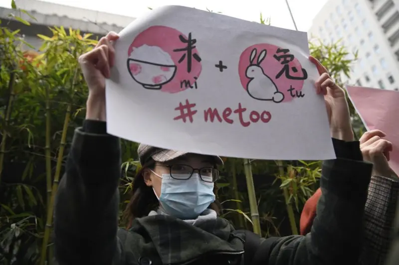

# The Driving Force and Impact of Digital Technologies on Feminist Communication Research in China

## Introduction

Since the early twentieth century, feminist ideas have gradually taken root in China alongside the global rise of egalitarian thought. Over time, their forms of expression have evolved—from print media and academic writing to interactive digital communication. With the growth of social media, feminist discussions have expanded beyond universities and traditional news outlets into public online spaces such as **Weibo**, **Xiaohongshu**, and **TikTok**, giving rise to new forms of digital activism. These platforms create spaces where women can share experiences, advocate for equality, and engage in public debate.  

As a **graduate student in media studies**, my research explores how emerging digital technologies both **empower and reshape** feminist activism in China, transforming the methods and analytical frameworks available to researchers.

---

## 1. Opportunities Brought by Emerging Digital Technologies

### 1.1 Social Media as a Fertile Ground for Feminist Discourse

Feminist discourse introduced from Western contexts has rapidly developed in China, finding fertile ground on domestic platforms. **Weibo**, comparable to Twitter, and **Xiaohongshu**, similar to Instagram, provide accessible spaces for Chinese feminists to voice concerns and organize online activism. These platforms also offer rich data sources for scholars studying gendered communication.  

New technological practices further expand research opportunities. On Weibo, **automated bot accounts** such as *Radical Feminist Bot* and *Anti-Radical Feminist Bot* aggregate and repost feminist submissions, protecting anonymity while fostering debate. Such practices invite analysis of **automation, anonymity, and digital mediation** within feminist movements.

---

### 1.2 Digital Tools Enrich Research Methods and Representation

Digital technologies now serve as both **research objects** and **analytical tools**. Methods like **natural language processing (NLP)** and **corpus linguistics** allow scholars to quantify large volumes of feminist content on social media. **Text mining** and **content analysis** reveal thematic and linguistic patterns in online discussions.  

Because official APIs are often restricted, **automated scripts and crawlers**—used ethically—are crucial for data collection. For instance, **Bao (2024)** compiled a large corpus of Weibo and Zhihu posts containing “feminism,” analyzed via **Sketch Engine**. **Gu et al. (2024)** examined the hashtag **#StopMenstrualShaming** on Xiaohongshu to study advocacy against menstrual stigma.  

Advances in **data visualization** also enhance research depth. Tools like **Tableau** and **Power BI** enable scholars to build interactive dashboards showing the diffusion and reach of feminist topics. Such visual narratives make complex social media interactions more interpretable and engaging. **Wan et al. (2025)**, for example, analyzed co-occurrence networks of feminist hashtags on Xiaohongshu to map how certain tags cluster among female users.  

Thus, feminist media studies in China treat digital technology both as a **subject**—shaping activism—and a **method**—enabling innovative computational research.

---

## 2. Potential Disruptions Introduced by Emerging Technologies

Although new technologies empower activists and scholars, their **dual nature** also disrupts feminist expression and research methods.  

On Xiaohongshu, **personalized algorithms** amplify feminist content beyond its intended audience, sometimes exposing it to hostility. In response, users employ **hashtag re-appropriation**, tagging posts with non-feminist but female-oriented topics (e.g., parenting or cooking) to control exposure. This reflects how algorithms alter feminist visibility, prompting scholars to consider **algorithmic bias** and adapt data collection strategies.  

Meanwhile, **AI-driven censorship** and **keyword filtering** reshape feminist language. On Weibo and Xiaohongshu, terms like **#MeToo** are often suppressed. Activists thus use **coded language** and emojis to evade moderation ([GreatFire, 2012](https://en.greatfire.org/blog/2012/nov/new-censorship-weibo)). This creativity sustains discourse but complicates textual analysis for researchers.  

Finally, the rise of **short-video platforms** such as **Douyin (TikTok)** and **Reels** shifts feminist advocacy toward multimedia storytelling. However, video data are harder to collect and analyze at scale, challenging traditional text-based methodologies.  

Overall, technological shifts continually **reshape feminist communication**, requiring scholars to stay **methodologically agile** and aware of evolving digital ecosystems.

---

## 3. Conclusion

Feminist media research in China is deeply shaped by technological change. Each shift in the digital environment—whether a new platform, algorithm, or analytical tool—transforms both activism and scholarship. Rather than relying on a single “disruptive” technology, the field thrives through the interplay of **social media infrastructure**, **data analytics**, and **privacy-aware practices**.  

Technology simultaneously **empowers and constrains** marginalized voices. To navigate this paradox, researchers must maintain a **critical and ethical perspective**, ensuring that innovation serves social justice. Only through such vigilance can feminist scholars and activists continue advancing gender equality within China’s dynamic digital landscape.

---

## References

Bao, K. (2024). *Comparative analysis of representations of feminism across Chinese social media: A corpus-based study of Weibo and Zhihu.* *Social Media + Society, 10*(2). [https://doi.org/10.1177/20563051241274688](https://doi.org/10.1177/20563051241274688)  

Gu, Y., Yang, Y., Saiyinjiya, A., Wu, W., Chen, Q., Chen, S., & Literat, I. (2024). *Commerce meets activism: #StopMenstrualShaming and the dynamics of feminist advocacy on Xiaohongshu.* *International Journal of Communication, 18*, 3793–3817. [https://ijoc.org/index.php/ijoc/article/view/22324](https://ijoc.org/index.php/ijoc/article/view/22324)  

Wan, R., Tong, L., Knearem, T., Li, T. J., Huang, T.-H. K., & Wu, Q. (2025). *Hashtag re-appropriation for audience control on recommendation-driven social media Xiaohongshu (Rednote).* In *Proceedings of the 2025 CHI Conference on Human Factors in Computing Systems (CHI ’25).* [https://dl.acm.org/doi/10.1145/3706598.3713379](https://dl.acm.org/doi/10.1145/3706598.3713379)  

GreatFire. (2012, November 24). *New censorship on Weibo.* GreatFire.org. [https://en.greatfire.org/blog/2012/nov/new-censorship-weibo](https://en.greatfire.org/blog/2012/nov/new-censorship-weibo)
